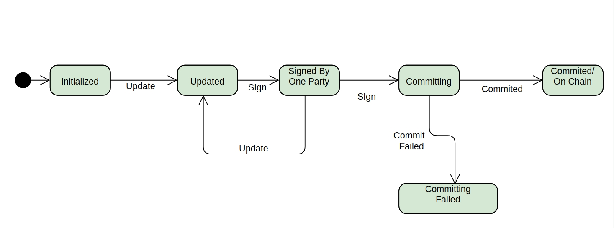

# ERC20 Off chain transaction using state channel

This is a standard ERC-20 token with support to settle receipt transaction between two parties offchain. 
Both parties can change the amount of the receipt multiple times. It uses state channel technique and finally commits to the chain when signed by both parties. 

## State diagram

 
--------------------
 

##### Features 

 -  [x] Off chain update receipt
 -  [x] Receipt State flow  
 -  [x] Parties sign the receipt
 -  [x] Save states to local storage
 -  [ ] Use sequence number when a contract is updated
 -  [ ] Keep track of receipt updated time 

## Requeriments to run this repository

- [Node.js](https://nodejs.org/download/release/latest-v10.x/): `>=10.0.0`
- [Truffle](https://www.trufflesuite.com/truffle): `v5.1.25`

